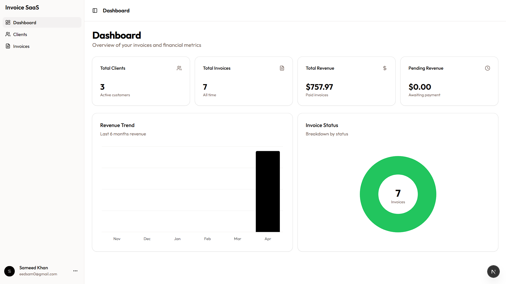
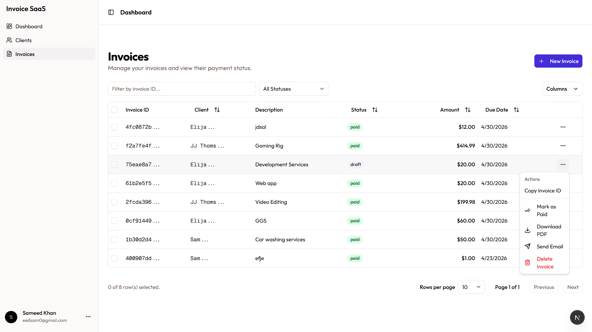
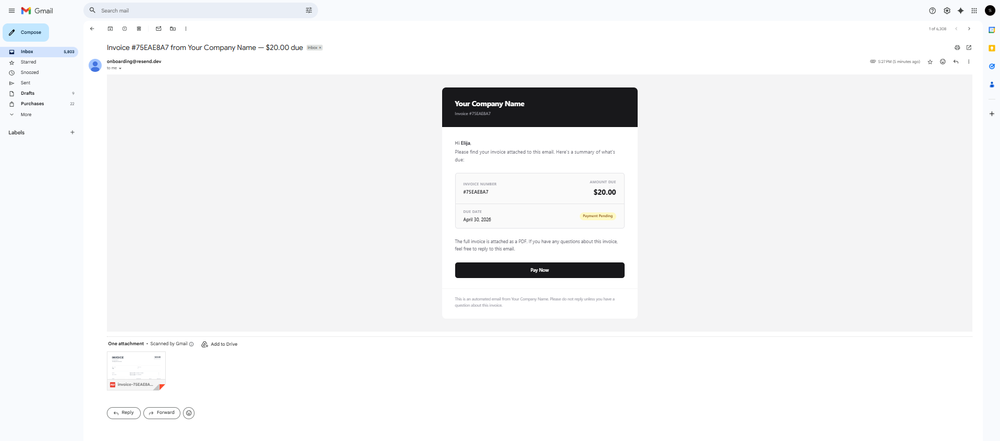
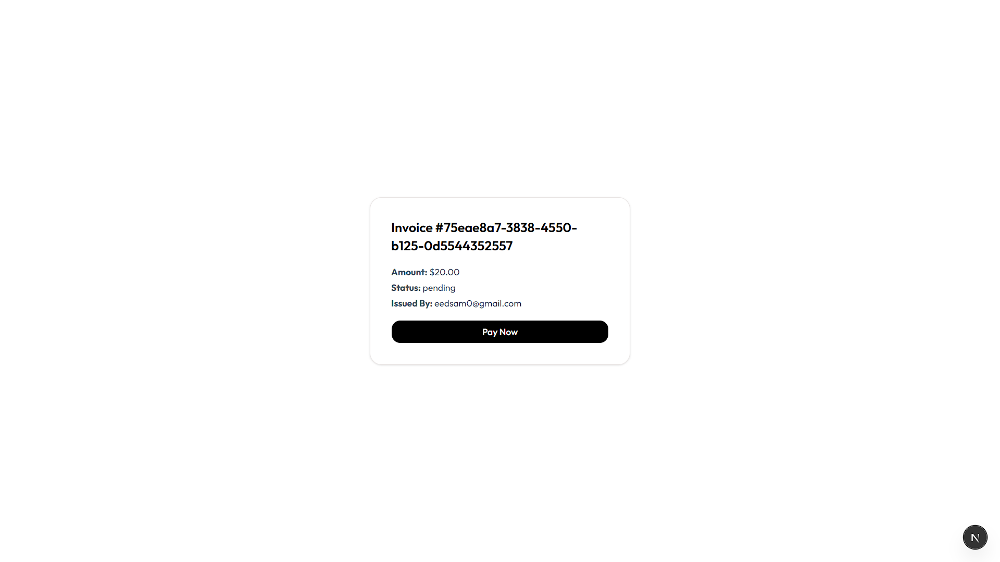
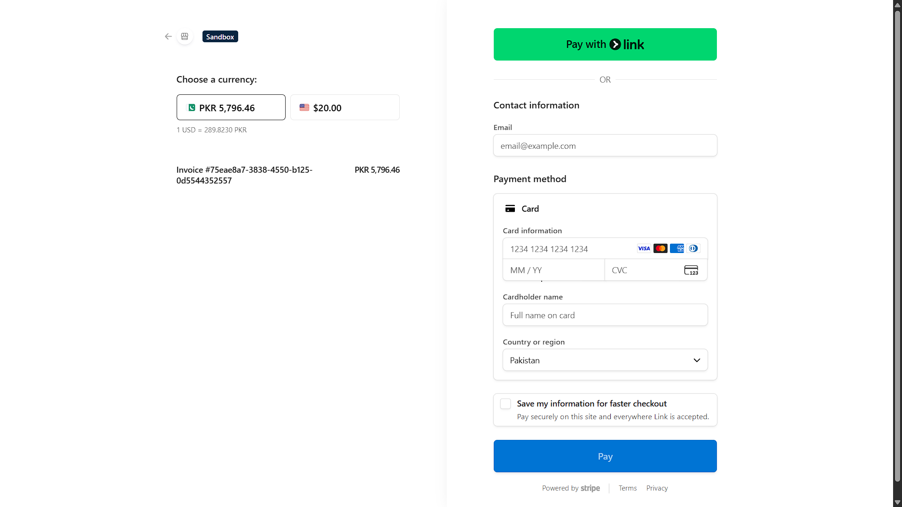
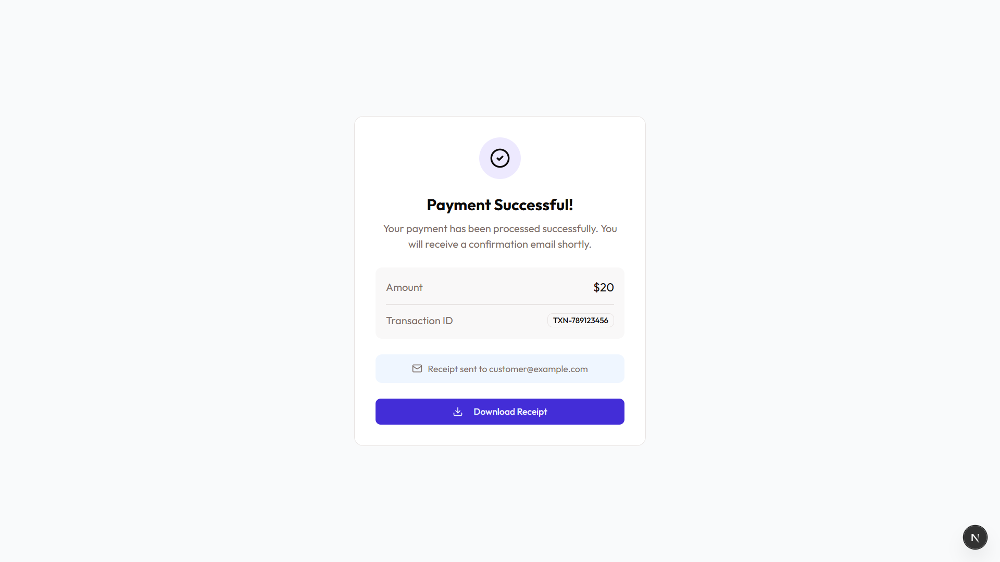
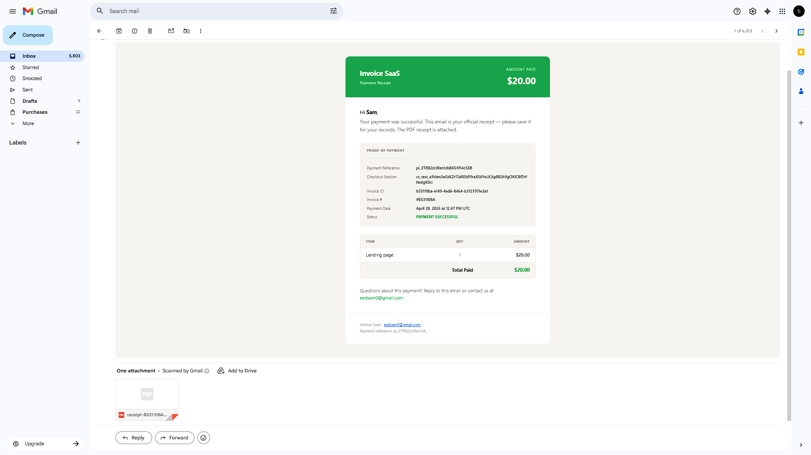
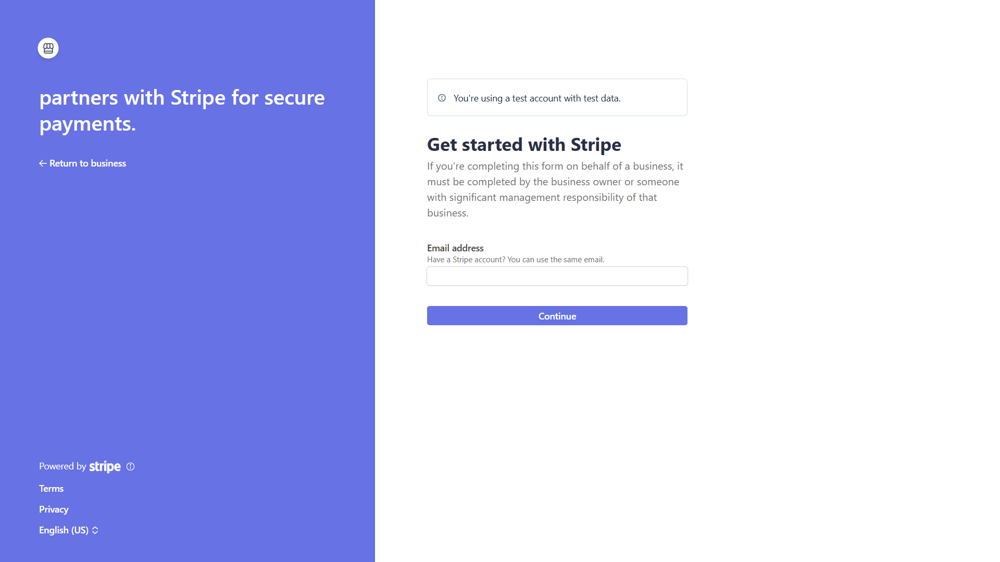
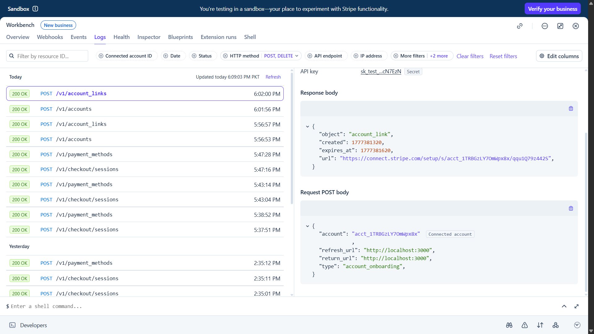

# Invoice SaaS
 
A full-stack invoice management platform built with Next.js 15, Drizzle ORM, Stripe Connect, and Resend. Create and send professional invoices, accept payments online, and automatically deliver receipts to clients.
 
<!-- 
  📸 SCREENSHOT: Full dashboard overview showing the sidebar, stats cards,
  and invoices table. Take this on a wide screen (1440px+). This is your
  hero image — make it look great.
-->

 
---
 
## Table of Contents
 
- [Features](#features)
- [Tech Stack](#tech-stack)
- [Getting Started](#getting-started)
  - [Prerequisites](#prerequisites)
  - [Installation](#installation)
  - [Environment Variables](#environment-variables)
  - [Database Setup](#database-setup)
- [Usage](#usage)
  - [Creating an Invoice](#creating-an-invoice)
  - [Sending an Invoice](#sending-an-invoice)
  - [Accepting Payments](#accepting-payments)
- [Stripe Integration](#stripe-integration)
  - [Stripe Connect Setup](#stripe-connect-setup)
  - [Webhook Configuration](#webhook-configuration)
- [Deployment](#deployment)
- [Project Structure](#project-structure)
- [Database Schema](#database-schema)
- [License](#license)
---
 
## Features
 
- 🔐 **Google OAuth** — Secure authentication via NextAuth.js
- 🧾 **Invoice Management** — Create, send, and track invoices with line items, due dates, and status tracking
- 👥 **Client Management** — Manage your client list with names and contact details
- 💳 **Stripe Connect** — Accept payments on behalf of users via Stripe Connect (platform model)
- 📄 **PDF Generation** — Auto-generate professional invoice and receipt PDFs using `@react-pdf/renderer`
- 📧 **Email Delivery** — Send invoices and payment receipts via Resend
- 🔔 **Webhook Automation** — Automatically mark invoices as paid and send receipts when payment completes
- 📊 **Dashboard Stats** — Revenue overview and invoice status breakdown
- 🔍 **Filterable Table** — Sort, filter, and paginate invoices with TanStack Table
- 📱 **Responsive** — Fully responsive layout built with Tailwind CSS and shadcn/ui
---
 
## Tech Stack
 
| Category | Technology |
|---|---|
| Framework | Next.js 15 (App Router) |
| Language | TypeScript |
| Database | PostgreSQL (via Neon) |
| ORM | Drizzle ORM |
| Auth | NextAuth.js v5 (Google OAuth) |
| Payments | Stripe Connect |
| Email | Resend |
| PDF | @react-pdf/renderer |
| UI | shadcn/ui + Tailwind CSS |
| Tables | TanStack Table v8 |
| Deployment | Vercel |
 
---
 
## Getting Started
 
### Prerequisites
 
Make sure you have the following installed:
 
- [Node.js](https://nodejs.org) v18 or higher
- [pnpm](https://pnpm.io) v8 or higher
- A [Neon](https://neon.tech) or any PostgreSQL database
- A [Stripe](https://stripe.com) account
- A [Resend](https://resend.com) account
- A [Google Cloud](https://console.cloud.google.com) project for OAuth
### Installation
 
```bash
# Clone the repository
git clone https://github.com/yourusername/invoice-saas.git
cd invoice-saas
 
# Install dependencies
pnpm install
 
# Copy environment variables
cp .env.example .env.local
```
 
### Environment Variables
 
Create a `.env.local` file in the root of the project and fill in the following values:
 
```env
# App
NEXT_PUBLIC_BASE_URL=http://localhost:3000
 
# Database
DATABASE_URL=postgresql://...
 
# Auth
AUTH_SECRET=your-nextauth-secret
AUTH_GOOGLE_ID=your-google-client-id
AUTH_GOOGLE_SECRET=your-google-client-secret
 
# Stripe
STRIPE_SECRET_KEY=sk_test_...
STRIPE_WEBHOOK_SECRET=whsec_...
 
# Resend
RESEND_API_KEY=re_...
RESEND_FROM_EMAIL=noreply@yourdomain.com
 
# Platform
PLATFORM_NAME=Your Company Name
PLATFORM_EMAIL=support@yourdomain.com
```
 
> **Note:** Never commit your `.env.local` file. It is already listed in `.gitignore`.
 
### Database Setup
 
This project uses Drizzle ORM. Run the following commands to generate and apply migrations:
 
```bash
# Generate migration files from schema
pnpm drizzle-kit generate
 
# Apply migrations to your database
pnpm drizzle-kit migrate
```
 
To inspect your database visually:
 
```bash
pnpm drizzle-kit studio
```
 
---
 
## Usage
 
### Creating an Invoice
 
1. Navigate to **Invoices** in the sidebar
2. Click **New Invoice**
3. Select a client, add line items, set a due date and payment terms
4. The live preview on the right updates as you type
5. Click **Create Invoice** — the invoice is saved with `draft` status
<!-- 
  📸 SCREENSHOT: The new invoice form with the live preview panel visible
  on the right side. Fill in some realistic sample data (client name,
  2-3 line items, a due date) so it looks complete. Capture the full
  page width showing both the form and preview side by side.
-->

 
---
 
### Sending an Invoice
 
1. On the **Invoices** page, find the invoice you want to send
2. Click the **⋯** actions menu on the right
3. Select **Send Email**
4. The client receives a professional email with the invoice PDF attached and a **Pay Now** link
5. The invoice status automatically updates to `pending`
<!-- 
  📸 SCREENSHOT: The invoices data table showing a row with status "pending"
  and the actions dropdown open, highlighting the "Send Email" option.
-->

 
<!-- 
  📸 SCREENSHOT: The actual email received in a real inbox (Gmail recommended).
  Show the email open with the invoice summary card visible. You can use
  a real test email for this. Blur or redact any personal info if needed.
-->

 
---
 
### Accepting Payments
 
Clients receive a unique payment link (`/pay/[invoiceId]`). Clicking **Pay Now** takes them to a Stripe-hosted checkout page. After payment:
 
- The invoice is automatically marked as `paid`
- The client receives a receipt email with a PDF containing full proof of payment
<!-- 
  📸 SCREENSHOT: The /pay/[id] page showing the invoice details card
  with the "Pay Now" button. Use a test invoice with a realistic amount.
-->

 
<!-- 
  📸 SCREENSHOT: The Stripe hosted checkout page (use Stripe test mode).
  Show the payment form with the line item and amount visible.
  Use card number 4242 4242 4242 4242 to complete a test payment.
-->

 
<!-- 
  📸 SCREENSHOT: Your custom /success page showing the animated
  checkmark and "You're all paid up" message after a completed payment.
-->

 
<!-- 
  📸 SCREENSHOT: The receipt email received in inbox (Gmail recommended).
  Open the email and show the green header, proof of payment table with
  the Stripe payment reference IDs, and the itemized breakdown.
-->

 
---
 
## Stripe Integration
 
### Stripe Connect Setup
 
This app uses **Stripe Connect** (Standard accounts) so that each user can accept payments directly into their own Stripe account.
 
1. Go to your [Stripe Dashboard](https://dashboard.stripe.com) → **Settings** → **Connect**
2. Enable Connect and note your **platform client ID**
3. In the app, go to **Settings** and click **Connect Stripe Account**
4. Complete the Stripe onboarding flow
5. Once connected, your `stripeAccountId` is saved and clients can pay you directly
<!-- 
  📸 SCREENSHOT: The Stripe Connect onboarding flow — the first screen
  after clicking "Connect Stripe Account" in your app, showing the
  Stripe onboarding UI. Use Stripe test mode.
-->

 
---
 
### Webhook Configuration
 
Webhooks allow Stripe to notify your server when a payment completes.
 
**For local development**, use the Stripe CLI:
 
```bash
# Install Stripe CLI
# Windows: https://github.com/stripe/stripe-cli/releases
# Mac: brew install stripe/stripe-cli/stripe
 
# Login
stripe login
 
# Forward webhooks to your local server
stripe listen --forward-to localhost:3000/api/stripe/webhook
```
 
Copy the webhook signing secret printed in the terminal and add it to `.env.local`:
 
```env
STRIPE_WEBHOOK_SECRET=whsec_...  # ← the one from stripe listen
```
 
**For production** (Vercel):
 
1. Go to [Stripe Dashboard](https://dashboard.stripe.com) → **Developers** → **Webhooks**
2. Click **Add destination**
3. Select **Your account** (not Connected accounts)
4. Select event: `checkout.session.completed`
5. Choose **Webhook** as destination type
6. Set the endpoint URL to:
   ```
   https://yourdomain.vercel.app/api/stripe/webhook
   ```
7. Click **Reveal** next to Signing secret → copy the `whsec_...` value
8. Add it to Vercel environment variables as `STRIPE_WEBHOOK_SECRET`
9. Redeploy your Vercel project
> **Important:** The local CLI secret and the Dashboard secret are different. Never mix them up.
 
<!-- 
  📸 SCREENSHOT: The Stripe Dashboard webhook endpoint page showing
  your production endpoint URL, the "checkout.session.completed" event
  selected, and a green "Enabled" status badge. Also shows Recent
  Deliveries with 200 status codes.
-->

 
---
 
## Deployment
 
This app is designed to deploy on [Vercel](https://saas-invoice-xzdd.vercel.app/).
 
```bash
# Install Vercel CLI
pnpm i -g vercel
 
# Deploy
vercel
```
 
Or connect your GitHub repository to Vercel for automatic deployments on every push.
 
**Required environment variables on Vercel** (add under Project → Settings → Environment Variables):
 
```
NEXT_PUBLIC_BASE_URL
DATABASE_URL
AUTH_SECRET
AUTH_GOOGLE_ID
AUTH_GOOGLE_SECRET
STRIPE_SECRET_KEY
STRIPE_WEBHOOK_SECRET
RESEND_API_KEY
RESEND_FROM_EMAIL
PLATFORM_NAME
PLATFORM_EMAIL
```
 
> After adding or changing environment variables, you must **redeploy** for changes to take effect.
 
---
 
## Project Structure
 
```
invoice-saas/
├── app/
│   ├── (auth)/
│   │   └── login/               # Login page
│   ├── (dashboard)/
│   │   ├── page.tsx             # Dashboard home + stats
│   │   ├── clients/             # Client list page
│   │   └── invoices/
│   │       ├── page.tsx         # Invoices table
│   │       └── new/             # Create invoice form + live preview
│   ├── api/
│   │   ├── auth/                # NextAuth handlers
│   │   ├── client/              # Client CRUD
│   │   ├── invoices/            # Invoice CRUD + send + PDF
│   │   └── stripe/
│   │       ├── checkout/        # Create Stripe checkout session
│   │       ├── connect/         # Stripe Connect onboarding
│   │       └── webhook/         # Stripe webhook handler
│   ├── pay/[id]/                # Public client payment page
│   └── success/                 # Post-payment success page
├── components/
│   ├── ui/                      # shadcn/ui components
│   ├── app-sidebar.tsx          # Main sidebar with user dropdown
│   ├── columns.tsx              # TanStack Table column definitions
│   ├── data-table.tsx           # Filterable, sortable invoice table
│   └── invoice-preview.tsx      # Live invoice preview component
├── db/
│   ├── index.ts                 # Drizzle DB client
│   └── schema.ts                # Database schema + types
├── drizzle/                     # Auto-generated migration files
├── lib/
│   ├── auth.ts                  # NextAuth configuration
│   ├── stripe.ts                # Stripe client
│   ├── email.ts                 # Invoice email sender (Resend)
│   ├── receipt-email.ts         # Receipt email sender (Resend)
│   ├── pdf.tsx                  # Invoice PDF generator
│   ├── receipt-pdf.tsx          # Receipt PDF generator
│   └── utils/
│       ├── zodSchema.ts         # Zod validation schemas
│       └── utilityFunctions.ts  # Helper functions
└── public/
    └── logo/                    # App logo assets
```
 
---
 
## Database Schema
 
```
users
├── id           uuid  PK
├── email        text  unique
├── password     text
├── stripeAccountId text
└── createdAt    timestamp
 
clients
├── id           uuid  PK
├── userId       uuid  FK → users.id (cascade)
├── name         text
├── email        text
└── createdAt    timestamp
 
invoices
├── id           uuid  PK
├── userId       uuid  FK → users.id (cascade)
├── clientId     uuid  FK → clients.id (cascade)
├── description  text
├── items        jsonb  (InvoiceItem[])
├── amount_cents integer
├── dueDate      timestamp
├── status       enum  (draft | pending | paid | overdue)
├── createdAt    timestamp
└── updatedAt    timestamp
```
 
**`InvoiceItem` shape (stored in `items` JSONB column):**
 
```ts
{
  description: string;
  quantity:    number;
  unitPrice:   number; // in dollars (e.g. 50.00)
}
```
 
---
 
## License
 
MIT License — feel free to use this project as a portfolio piece or starting point for your own SaaS.
 
---
 
<p align="center">Built by <a href="https://github.com/SameedKhan12">Sameed Khan</a></p>
 